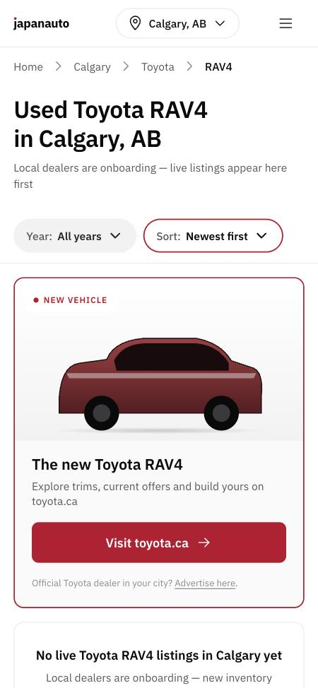
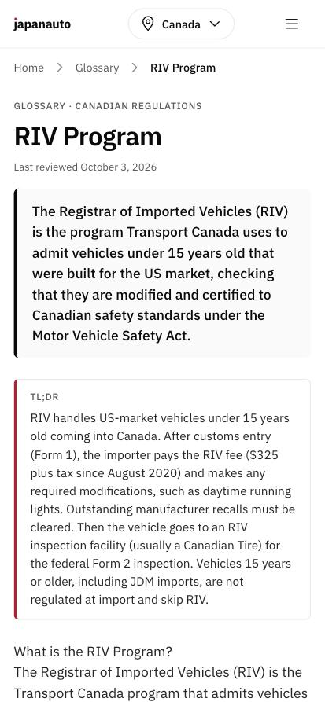
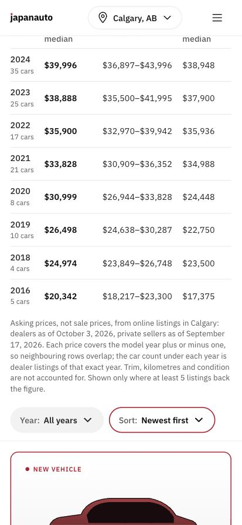

# Аудит SEO / GEO и «ИИ-следов» в текстах — japanauto.ca, 2026-10-03

> Охват: весь собранный сайт (`~/sites/japanauto`, 925 HTML-страниц), 49 редакционных материалов, шаблонные тексты в `src/data` и шаблонах, 49 макетов Buyer's Guides (`GUIDES-*`).
> Исполнение: 9 агентов (2 аудита, 3 прохода по ИИ-следам, 3 сверки фактов по первоисточникам, 1 веб-сверка) + ручные правки.
> Коммиты: `6936532`, `509586f` на ветке `market-sync-diff`. Preview: https://1f56366a.japanauto.pages.dev (alias `market-sync-diff.japanauto.pages.dev`).
> **Обновление 2026-10-03, вечер:** ветка `market-sync-diff` слита в `main` (fast-forward, вместе с работой оценщика) и выкачена в продакшен (`main` @ `00a20a0`). Добавлены короткие ответы (answer capsules) и публичные цены Калгари — раздел 8. Решения Andrew: цены показываем; французскую версию пока не делаем; ИИ-помощь в editorial-policy не раскрываем.

## TL;DR

| | До | После |
|---|---|---|
| Индексируемых страниц | 910, из них **841 с нулём объявлений** (soft-404 / doorway) | **77**, пустые — `noindex, follow`, вне sitemap; откроются сами, когда появится инвентарь |
| Похожесть city×model страниц одной модели в разных городах | 0.79–0.86 (Jaccard), 93–97 % шаблонного текста | закрыты от индекса до появления данных; FAQ: 40 разных скелетов вместо 4 |
| llms.txt | ручной, 7 из 10 ссылок блога — 404 | генерируется из коллекций, 62 ссылки, все живые (гейт в аудите) |
| `.md`-версии страниц | 0 | 49 (блог, глоссарий, бренды) + `rel=alternate` + `_headers` |
| robots.txt | именованные боты обходили Disallow на `/api/`, `/dealer/` | одна группа, Content-Signal `search=yes, ai-input=yes, ai-train=no` |
| Выдуманные цифры на страницах | «~78 listed», «150+ dealers», «Updated today», AMVIC в Онтарио/BC/QC (236 описаний) | удалены / привязаны к реальным данным; регулятор по провинции |
| Авторы и рецензенты | псевдонимы с выдуманными биографиями + «AMVIC-licensed advisor» | japanauto.ca Editorial (Organization), editorial-policy описывает реальный процесс |
| Фактические ошибки | ~60 (RIV, iZEV, продажи Toyota, CPO Lexus, PPI $400–600, двигатели…) | исправлены по первоисточникам, ссылки добавлены в `sources` |
| Длинные тире (главный ИИ-маркер) | сайт: 348 в статьях + 405 в шаблонах/глоссарии; гайды: 917 | 0 в статьях, 55 в шаблонах (34 — суффикс title), 98 в гайдах |
| Повторяющиеся 6-граммы между брендовыми страницами | 26–56 на страницу | 5–22 |

Гейты: `typecheck` ✅ · `vitest` 85/85 ✅ · `astro build` 925 стр. ✅ · `audit:seo` ✅ · `audit:launch` ✅.

---

## 1. Технический SEO

### B1 (BLOCKER, исправлено) — 841 пустая индексируемая страница

`catalog-live.json` пуст (`listings: []`), но все шаблоны инвентаря были индексируемыми и в sitemap. Замеры (5-граммы, имена городов/моделей заменены плейсхолдерами):

| Шаблон | Стр. | Различных текстов | Доля шаблона |
|---|---|---|---|
| `/{city}/{make}/{model}/` | 300 | 50 | 93 % |
| `/{city}/parts/{make}/{model}/` | 300 | 282 | 97 % |
| `/used-cars/{make}/{model}/` | 50 | **1** | 100 % |
| `/{city}/parts/` | 6 | **1** | 100 % |

**Сделано:** `src/lib/indexability.ts` — одно правило «индексировать ли URL». `BaseLayout` выводит `noindex, follow` по pathname, `sitemap-static.xml.ts` фильтрует через ту же функцию → рассинхрон невозможен. Порог `MIN_INDEXABLE_LISTINGS = 1`. Parts-шаблоны закрыты целиком, пока доноры не экспортируются в SSG (B2). Пустые категории блога тоже.

### B2 (открыто) — parts-шаблоны захардкожены на ноль доноров
`[city]/parts/[make]/[model]/index.astro:40-42` и ещё 5 шаблонов: `count: 0, donors: []`. `export-catalog-data.mjs` не выгружает доноров. Страницы доноров `/parts/listing/*` доступны только через `sitemap-donors.xml`. Нужен экспорт доноров + `getDonorsFor()` — отдельная задача; пока закрыто через B1.

### Прочее (исправлено)
- **robots.txt (M1):** по RFC 9309 бот слушает только свою группу — GPTBot/Googlebot/… не видели Disallow на `/api/`, `/dealer/`, `/auth/`, `/dashboard/`. Теперь одна группа; добавлены Claude-User, Claude-SearchBot.
- **Preview-хост:** `x-robots-tag: noindex, nofollow` на каждом ответе `*.pages.dev` (раньше только robots.txt).
- **Sitemap:** убран build-date `lastmod` у главной, `hourly` → `daily`, добавлены 10 статических страниц (about, contact, pricing…).
- **Function карточки объявления:** пустые привод/КПП/топливо/кузов подставлялись как AWD/Auto/Gasoline/Sedan — и в текст, и в `Vehicle` schema. Теперь неизвестное не выводится. Убраны FAQ «типичный пробег» (подставлял пробег самой машины) и общий «надёжность».
- **page-shell (Functions):** `lang="en-CA"`, hreflang, то же описание Organization, что и в SSG.
- **Перелинковка:** `/brands/{make}/` (лучший контент сайта) получали 1 входящую ссылку — добавлена ссылка «Read our {Brand} buyer's guide» с 69 страниц.

### Открыто (MEDIUM/LOW)
- M5: на 486 страницах скрытый `sr-only` H1 + видимый H2 с тем же текстом → `PageHeading as="h1"`.
- M7: Монреаль без французского — либо `/fr/`, либо оставить (сейчас city-model Монреаля всё равно noindex).
- M8: при cutover — 301 `japanauto.pages.dev → japanauto.ca`.
- L: per-model OG-картинки (сейчас одна на весь сайт), self-host шрифтов, `rel="sponsored"` на featured-слотах после продажи, `Car` вместо `Vehicle`, 0 `` на сайте.
- M4: каталог обновляется только при деплое — проданные объявления остаются в сетке с `InStock` до следующего билда. Нужен ежедневный ребилд или рендер сетки из Function.

---

## 2. GEO (нейросети)

| Правило фабрики | Было | Стало |
|---|---|---|
| AI-боты разрешены | ✅ (с дырой в группах) | ✅ |
| Content-Signal | ❌ | ✅ |
| llms.txt генерируется | ❌ статический, 70 % битых ссылок | ✅ `src/pages/llms.txt.ts` |
| `.md` каждой страницы | ❌ | ✅ для 49 редакционных; маркетплейс — после answer capsule |
| Answer Capsule в первых 200 словах | блог/глоссарий ✅, маркетплейс ❌ | без изменений (см. H3) |
| Schema triple-stack | частично | автор → `#organization`, без поддельного `reviewedBy` |
| Даты | видимая дата на день раньше JSON-LD | `formatIsoDate` в UTC; `last_reviewed` 2026-10-03 у всех 49 |
| Честные факты | «~78 listed», «150+ dealers», AMVIC в QC | гейт в `audit:seo` ловит регрессии |

**Новые гейты в `scripts/seo-audit.py`** (всегда включены): `Updated today`, `[verify`, `150+ dealers`, `~N listed`, AMVIC в описании не-альбертовской страницы, индексируемая страница с пустым состоянием, ссылки llms.txt и sitemap только на индексируемые URL.

### Открыто — самый большой выигрыш для цитируемости
- **H3. Answer Capsule на страницах маркетплейса.** Первые 200 слов city×model — «Dealers onboarding». Данные уже есть (`price-generations.ts`, поколения, регулятор провинции) → компонент `AnswerCapsule.astro`.
- **H4. Публиковать агрегаты рынка.** ~18,6 тыс. лотов синкаются ежедневно, но видны только дилеру в приватной панели. Медиана / P25–P75 / n по модели×городу (n ≥ 10, сегменты dealer/private раздельно, дата «as of», `Dataset` JSON-LD) — то, что LLM цитируют дословно. Нужна страница `/methodology/`. Решение по данным и ToS источников — за тобой.
- **M5:** таблиц на сайте 0 — сравнение CX-5/CR-V/RAV4 и регуляторов просятся в таблицы.
- **M6:** IndexNow пингует только при активации объявления; нужен post-deploy пинг изменённых URL. После cutover: Bing Webmaster Tools + GSC + разовый пинг всех URL.

---

## 3. Признаки ИИ-текста и правки

Рубрика: `docs/audits/2026-10-03-seo-geo/ai-tells-rubric.md` (лексика, отрицательный параллелизм «not X, but Y», тройки, тире, морализующие концовки, кросс-страничные скелеты, фальшивая точность).

### Блог (10) + бренды (9)
| Метрика | До | После |
|---|---|---|
| Длинные тире в теле | 348 (6.4–15.4 на 1000 слов) | 0 |
| Слова из стоп-листа | 21 | 4 (уместные) |
| «Not X but Y» | 3 | 0 |
| 6-граммы в 3+ файлах | 129 | 47 |
| Объём | 33 438 слов | 31 064 (−7 %) |

Главные маркеры: одинаковый абзац «Browse current inventory by city…» на всех 9 брендах; FAQ-ответы «It depends… Both are appropriate» без вердикта; «structural/structurally» ~30 раз; «This piece walks through…» в начале каждого поста.

Примеры:
- «isn't reliability mythology. It's depreciation math» → «are betting on depreciation more than on the reliability legend»
- «It depends on weight… Both are appropriate Canadian luxury platforms.» → «If you'll keep the car past warranty and care about running costs, buy the Acura… Buyers who mostly want comfort should go Lexus.»
- «Engine reliability is not the issue… CVT reliability is.» → «The engines are fine; the CVTs are the risk.»

### Глоссарий (30) + шаблоны + `src/data`
| Метрика | До | После |
|---|---|---|
| Тире | 405 | 55 (34 — суффикс title) |
| Отрицательный параллелизм | 35 | 9 |
| 8-граммы в 3+ файлах | 91 | 55 |
| Скелетов FAQ на 300 city×model | ~4 | 40 (ответы из реальных поколений модели) |

Новый файл `src/lib/model-copy.ts` собирает текст про поколения/фейслифты из существующих данных. Регулятор по провинции: `DEALER_REGULATOR` в `brand-content.ts`.

### Buyer's Guides (49 макетов)
| Метрика | До | После |
|---|---|---|
| Тире | 917 (11 на 1000) | 98 (1.2) |
| Повторы 6-грамм между страницами | 1435 | 1328 |
| Целостность цифр | — | 115/116 проверок идентичны; 1 расхождение — HTML-сущность `&#x27;` |

Правились исходники (`GUIDES-TOOLS/copy_<make>.py`, `build_guides.py`, `price-guide.js`, 11 строк в `findings.json`), страницы пересобраны штатной командой. Все 294 bullet «лучшие/худшие годы» были в формате `<b>X</b> — reason` — главный маркер. 64 тыс. слов карточек проблем (терсовые заметки с таймкодами) сознательно не трогались. Бэкап исходников до правки: `GUIDES-TOOLS/backups/guides-backup-2026-10-03.tgz` (Obsidian); в каждом `GUIDES-<MAKE>/README.md` добавлена пометка.

---

## 4. Фактические ошибки, найденные и исправленные

Сверка по первоисточникам (tc.canada.ca, cbsa-asfc.gc.ca, ontario.ca, alberta.ca, media.toyota.ca, lexus.ca, mitsubishi-motors.ca, quebec.ca, saaq.gouv.qc.ca, rdprm, omvic/vsabc/amvic).

**YMYL — критичные:**
- **RIV и 15-летние импорты** (2 статьи блога + 5 статей глоссария): писали, что JDM-машина 15+ лет проходит RIV и Form 2. Неверно: такие машины «not regulated at the time of importation», RIV — только для US-машин младше 15 лет. Статья про импорт JDM переписана (включая H1).
- **Пошлина:** «duty-free under CUSMA» для японских машин — неверно. 0 % по CPTPP с сертификатом происхождения, иначе 6,1 %.
- **Онтарио:** таблица дважды считала GST; частные продажи облагаются 13 % RST, не HST.
- **EV-ребейты:** iZEV закрыт в январе 2025-го, с 16.02.2026 действует EVAP ($5 000 / $2 500, потолок $50 000, до 31.03.2031). Ребейт BC отменён, Roulez vert до 31.12.2026.
- **PPI:** $400–600 → $150–300 (BCAA $249,95; AMA Calgary ~$200–240).
- **Salvage в Онтарио:** бренды None/Salvage/Rebuilt/Irreparable; для Rebuilt нужен Structural Inspection Certificate.
- **CMVSS 126** — это ESC, а не ABS.
- **Регуляторы «лицензируют советников»** — нет, они лицензируют дилеров и продавцов.

**Цифры брендов (бывшие `[verify Q3]`, видимые на 7 страницах):** Toyota 209 тыс. (бренд) / 239 тыс. (с Lexus) в 2024-м, а не 245 тыс.; «больше Hyundai+Kia+VW вместе» удалено (ложь); RAV4 77 556. Infiniti ~40 дилеров (не 30). Lexus CPO 1 год / 20 000 км (не «до 6 лет»). Honda Alliston — мощность 400 тыс., не выпуск.

**Модели и двигатели:** поколения Civic, Si на 1.5T, 2GR-FE на цепи, Ascent только турбо, QX50 не на платформе Murano, «TRD-developed AWD» удалено, SH-AWD на Integra отсутствует, Mazda CX-50 не первая североамериканская Mazda и др. Полный список — `2026-10-03-seo-geo/glossary-factcheck-list.md` и отчёты агентов в истории сессии.

**Камри-гайд:** TL;DR противоречил телу (180–220 тыс. км против 130–160 тыс.) — выровнено.

---

## 5. E-E-A-T — сделано по твоему решению «честно сейчас»

- Все 49 материалов: `author: japanauto-editorial`, `reviewer_role` удалён. В schema `author` → `#organization`, `reviewedBy` больше не эмитится.
- `/editorial-team/`: персоны Marc Tremblay и Sarah Chen с выдуманными биографиями и `Person`-узлами удалены. Страница описывает маленькую in-house команду в Калгари.
- `/editorial-policy/`: убраны обещания «рецензент назван в подписи» и «сверка с сервисной документацией». Описан реальный процесс: факты сверяются с источниками, указанными на странице; Last reviewed означает дату перепроверки; добавлен раздел «Independence» про платные размещения.
- Анекдоты от первого лица («A friend in Calgary…», «One Calgary owner we know…», «A 2008 RDX I considered…») переписаны в нейтральные примеры.

---

## 6. Что решить Andrew

1. **Выкатка в продакшен.** Прод = `main` @ `40a0427`. Мои коммиты лежат на ветке `market-sync-diff` поверх 4 незамёрженных коммитов сессии «Инструмент оценки автомобилей» (market-sync diff, /ops, данные поколений). Варианты: (а) замёржить ветку целиком в `main` и выкатить в прод; (б) cherry-pick только `6936532` + `509586f` в `main`. Сайт пока не на japanauto.ca, так что срочности нет.
2. **Публиковать ли агрегаты рыночных цен** (H4) — самый сильный GEO-рычаг. Нужно решение и проверка ToS источников.
3. **Монреаль:** французская версия или нет.
4. **Раскрытие ИИ-помощи** в editorial-policy: сейчас про это ни слова, обещания «написано людьми» тоже нет.
5. **Настоящий рецензент для YMYL** (регуляторика, налоги, импорт) — когда будет, вернуть `reviewedBy` с именем и ссылкой на реестр.

## 7. Что осталось на ручную вычитку

- Неподтверждённые цифры: проценты удержания стоимости Canadian Black Book (RAV4 ~70 %, Corolla 64 %…), сборы за регистрацию/сертификаты/брокеров, стоимость замены CVT и ремня ГРМ.
- Переносимость 10-летней гарантии Mitsubishi на второго владельца: на сайте теперь «проверьте по VIN».
- Гайды: ~255 строк «Not stated» в стоимости ремонта, мили вперемешку с км, «dollars» вместо $, сырые YouTube-ссылки в «Where they disagree», одиночные утверждения (RVR «половина машин после ДТП», «hundreds of complaints» у Highlander).
- Mazda CX-7 (снята в 2012-м): 7 страниц моделей никогда не получат объявлений при 10-летнем лимите — убрать из `MODELS_BY_BRAND`.
- `reviewer_role`-подобная лексика в ключах: primary keyword «jdm import canada riv» у статьи, которая теперь говорит «RIV не нужен».

---

## 8. Короткие ответы на страницах каталога + цены Калгари (2026-10-03, вечер)

**Что на странице под H1** (`src/components/sections/AnswerCapsule.astro`):
- **Город × модель (300):** какие модельные годы и поколения в 10-летнем окне; регулятор провинции и налоговое правило (дилер / частная продажа); статус объявлений. В Калгари: «дилеры рекламируют около N машин, медиана $X за {год} и $Y за {год}» + таблица по годам (медиана дилеров, средняя половина цен, медиана частных, точное число машин этого года).
- **Город × марка (54):** в Калгари — топ-3 самых рекламируемых модели с медианой; в других городах — список моделей. Плюс регулятор и налоги.
- **Национальная страница модели (50):** поколения + медианы Калгари со ссылкой на калгарийскую страницу.

**Правила честности** (ADR 0021, `docs/decisions/0021-public-market-prices-calgary-pilot.md`): только агрегаты, только Калгари; дилеры и частные не смешиваются; это цены предложения, а не продажи; каждый год = год ±1; в окне цены минимум 5 объявлений и минимум 1 машина точного года; не новее «текущий год − 2» (у дилеров есть новые машины); даты по каждому сегменту; Facebook не называется.

**SEO/GEO:**
- 38 страниц моделей Калгари с таблицей + 9 хабов марок Калгари стали индексируемыми без объявлений (всего индексируемых 124).
- Title «Used {Model} Prices in Calgary by Year», description с медианами, FAQ о цене отвечает данными, `Dataset` JSON-LD, раздел цен Калгари в llms.txt.
- Гейт аудита: пустая сетка объявлений допустима только если на странице есть рыночная таблица.

**Данные:** `scripts/export-market-data.mjs` в `predeploy` → `src/data/market-live.json` (коммитится). Модуль `src/lib/market.ts`, провинциальные факты — `PROVINCE_FACTS` там же.

**Осталось / к сведению:**
- На индексируемых страницах Калгари всё ещё висит демо-креатив «NEW VEHICLE · The new Toyota RAV4 → toyota.ca» (featured house ad). По памяти проекта он должен уйти до запуска.
- Расширение на другие города — после валидации пилота (одна строка `PILOT_CITIES`).
- `main` опережает `origin/main` на 9 коммитов, в GitHub не пушил.
- Ветка содержит изменения воркера `expire-sweeper` (market-sync diff) — Pages-деплой их не выкатывает, воркер деплоится отдельно.
